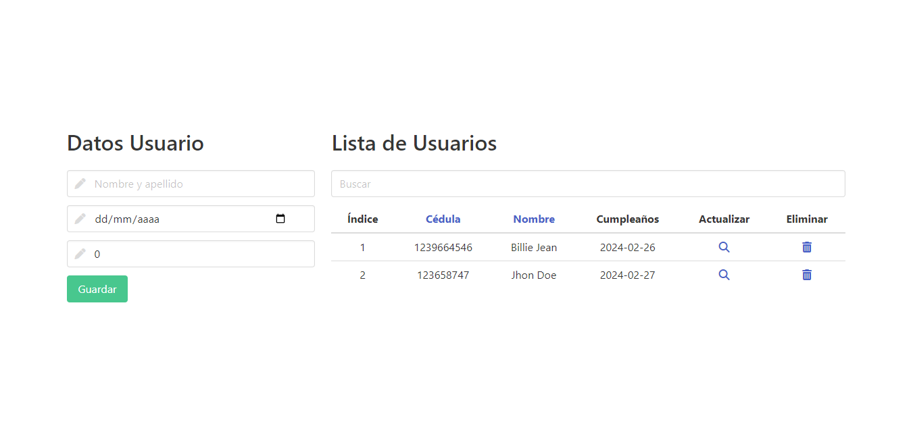
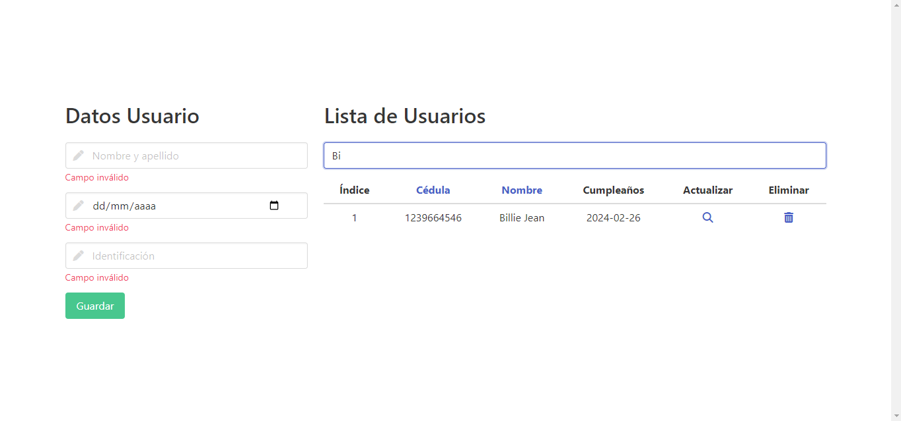

# JavaAngular

Prueba técnica para el cargo: Desarrollador java-angular

Crear un CRUD que permita registrar una persona, modificar y eliminar; y mostrarlos en un listado
que permita filtrar y ordenar.
Se debe realizar con la siguiente estructura:

- Base de datos PostgreSQL
- Backend java (obligatorio)
- Frontend angular (obligatorio)

Obligatorio los siguientes campos:
- Nombre, número de cédula (identificador único) y fecha de nacimiento.
- 48 horas.

## Descripción y pasos para ejecutar el código

El frontend está desarrollado utilizando Angular 16.2.9.

El backend está desarrollado con Java JDK 17, utilizando Maven, y Spring Boot para Java. 

- Clonar repositorio:

```
git clone https://github.com/mfquinonesc/JavaAngular.git
```

- Ubicarse dentro de la carpeta backend, encontrar el archivo `backend\src\main\java\dev\backend\BackendApplication.java` y ejecutar según el editor el Debug o Run.

- La aplicación java se debe ejecutar en la ruta `http://localhost:8080/api/v1/user` que es el endpoint de la API.

- Ubicarse dentro de la carpeta frontend y ejecutar en consola el comando `ng serve -o`

- La palicación se debe ejecutar en la ruta `http://localhost:4200/` .

## Capturas de la aplicación 



<!--  -->

## Funcionamiento 

- En el formulario Datos Usuario se crean y actualizan los usuarios. 

- En la tabla Lista de Usuarios aparece un campo llamado `buscar` par filtrar la tabla según el texto ingresado en él.

- Con las cabeceras de la tabla Cédula y Nombre al hacer click se ordenan los registros de la tabla.

- En la parte derecha de la tabla aparecen dos íconos: ver (la lupa) y eleiminar (la caneca). El primero realiza las funciones de mostrar la información en el formulario para ser editada y el segundo elimina el regirstro.